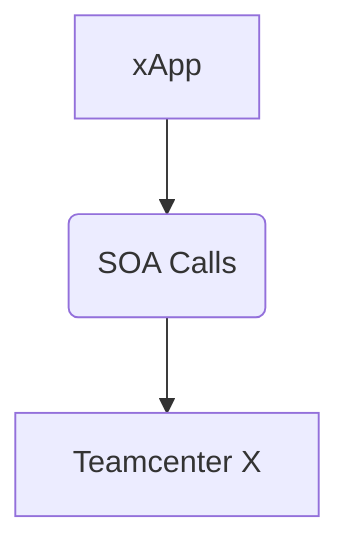
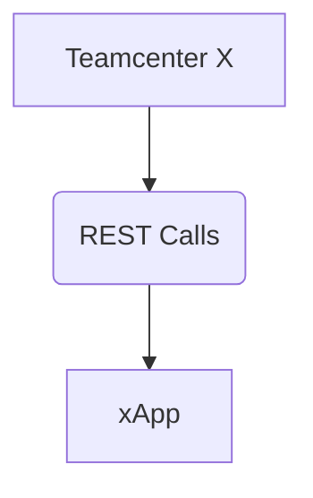

# xApps Integration with Teamcenter X

An **xApp** is defined as any external system that communicates with Teamcenter X.

## Ingress (Incoming)

The traditional authentication process for xApps typically involves sending username and password credentials via SOA to access the Teamcenter server. This method can introduce security vulnerabilities, as credentials may be exposed during transmission and storage.

To mitigate these risks, an OAuth token-based authentication system is now available. This system leverages the FDS service, offering a more secure and modern approach for xApps to authenticate with Teamcenter.

## Egress (Outgoing)

The pipeline supports generating an OAuth token for any Teamcenter component (e.g., ShapeSearch or Multi-site) to make outbound connections to xApps (or other Teamcenter X instances) that support an OAuth token-based authentication system.

# Versions Supported

Testing for xApps integration has been completed on the following versions:

| Software   | Versions Supported     |
|------------|------------------------|
| Teamcenter | Tc 2506.0001 and Later |
