# XCR Kubernetes Cluster Setup – Azure

## 1. Introduction

**Contact Details:** `anderson.matthew@siemens.com` (Matt Anderson) ; `benjamin.collar@siemens.com` (Ben Collar)

**Repository Access:** [`tcx-stormruntime`](https://gitlab.industrysoftware.automation.siemens.com/gitops/tcx-stormruntime) – Maintainers: Tushar Bhasme (tushar.bhasme@siemens.com), Donny Daniel (donny-thomas.daniel@siemens.com), Aishwarya Mehta (aishwarya.mehta@siemens.com), Yuvraj Chaudhary (yuvraj.chaudhari@siemens.com)

---

<details>
<summary>**2. Prerequisite**</summary>

#### XCR Kubernetes Cluster Setup – Pre-requisites

1. Activate your **User Access Administrator**, **RBAC** and **Contributor** access by [activating](../../../../Reference%20Resources/150_Appendix/030_Activating%20Roles%20and%20Groups%20via%20PIM.md) the Provisioner Group assignment on the target `AZURE_SUBSCRIPTION_ID` (e.g., through PIM or Owner access of the Subscription).

    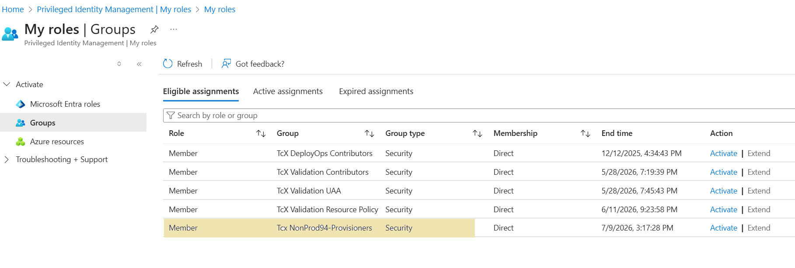

</details>

---

<details>
<summary>**3. Operation**</summary>

### Enable necessary providers

Ensure Contributors role is [active in PIM](../../../../Reference%20Resources/150_Appendix/030_Activating%20Roles%20and%20Groups%20via%20PIM.md).
Open a Bash Cloud Shell in Azure. Execute below commands:

```bash
az account set -s [subscription_id]

az provider register --namespace Microsoft.Storage
az provider register --namespace Microsoft.ManagedServices
az provider register --namespace Microsoft.Network
az feature register --name EncryptionAtHost --namespace Microsoft.Compute
```

---

### Setup custom role for Virtual Network Peering

#### Create custom role for peering

1. Ensure User Access Administrator and RBAC roles are [active in PIM](../../../../Reference%20Resources/150_Appendix/030_Activating%20Roles%20and%20Groups%20via%20PIM.md).
    - Navigate to `Privileged Identity Management` -> `Tasks` -> `My roles` -> `Groups`
    - `Activate` the `[subscription name] Cell Provisioners` Group created in section [Create Groups for Your Subscriptions](../../020_Tools%20Access/010_Cloud%20Account%20Request/Azure/020_Setup%20Azure%20and%20Entra%20Groups%20and%20Roles.md#create-groups-for-your-subscriptions)
    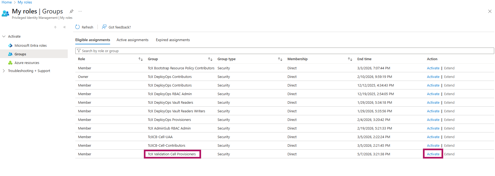
2. Navigate to Subscriptions and select your subscription.
3. Go to Access Control (IAM) and click on `+Add` -> `Add custom role`.

    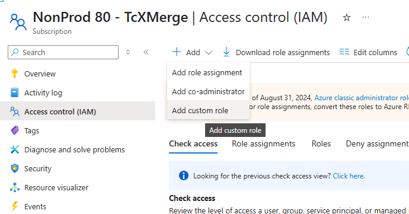
4. Set the role name `TcX-NetworkWriter-Role-[team-name]`

    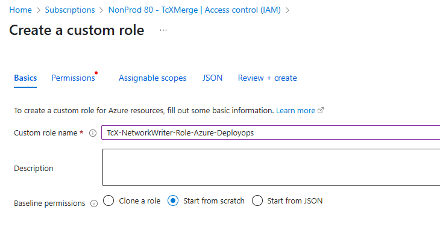
5. Navigate to `JSON` tab, click `Edit`.
6. Update below template to replace `[team-name]` with your team name and `[subscription-id]` with your subscription, and use it to set the permissions:

    ```bash
    {
        "properties": {
            "roleName": "TcX-NetworkWriter-Role-Azure-[team-name]",
            "description": "",
            "assignableScopes": [
                "/subscriptions/[subscription-id]"
            ],
            "permissions": [
                {
                    "actions": [ 
                      "Microsoft.Network/register/action", 
                      "Microsoft.Network/virtualNetworks/write", 
                      "Microsoft.Management/getEntities/action", 
                      "Microsoft.Authorization/policyDefinitions/read", 
                      "Microsoft.Authorization/policyAssignments/read", 
                      "Microsoft.Network/virtualNetworks/listNetworkManagerEffectiveConnectivityConfigurations/read", 
                      "Microsoft.Network/virtualNetworks/read", 
                      "Microsoft.Network/networkGroupMemberships/read" 
                    ],
                    "notActions": [],
                    "dataActions": [],
                    "notDataActions": []
                }
            ]
        }
    }
    ```
    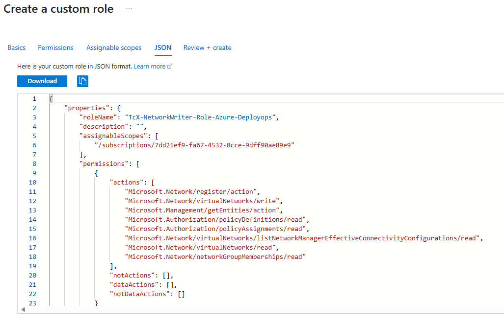

7. Click `Save` -> `Review + Create` -> `Create`.

#### Assign the custom role to XCR

1. Navigate to Subscriptions and select the subscription where the TcX cell is to be setup.

2. Go to Access Control (IAM) and click on `+Add` -> `Add role assignment`.

  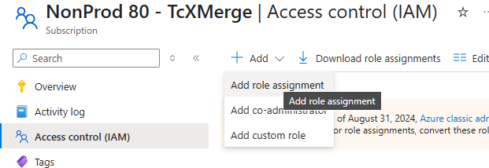

3. Search for the role `TcX-NetworkWriter-Role-Azure-[team-name]` created above, select `Next`.

  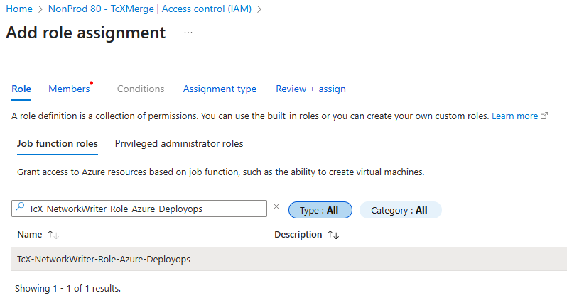

4. Select `User, group, or service principal`, click on `+Add members`, search for `AZM-XCR-SERVICE`. Select and click `Next`.

  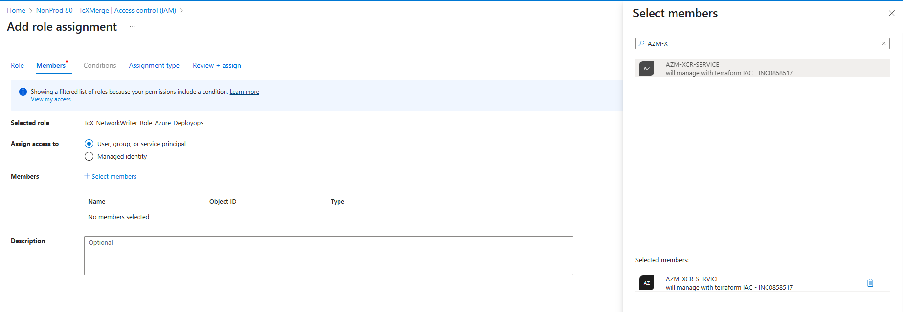

5. Set `Assignment type` as `Active` and `Assignment duration` as `Permanent`.

  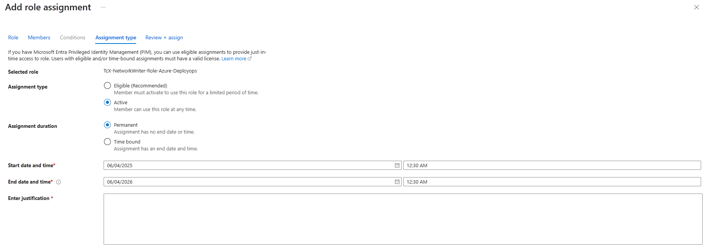

6. Select `Review + assign`.

---

### Raise FDS ticket for cluster

1. Raise cluster request form at [FDS](https://fdsone.atlassian.net/servicedesk/customer/portal/9/group/105/create/188)
2. Fill in the following ticket fields:

    Note: from TC2506.0002 patch release, Teamcenter AI Chat (Product ID: TC030406-XT) is supported, hence if required to configure XCR cluster for Teamcenter AI Chat, you need to provide few extra inputs along with current inputs in FDS cluster request, please refer this link [here](../../../../../Product%20Integration%20Documentation/Teamcenter%20AI%20Chat/020_Cell%20Onboarding/010_AZURE/010_AI%20Search/010_AI%20Search.md)

    ```bash
    Contact us about: Product Onboarding Request  
    What can we help you with?: XCR Onboarding
    Summary: Request for [REGION] AZM new Dedicated Cluster
    Request type: Cluster Onboarding Request
    Business Unit/Segment: [Team Segment, eg DI SW LCS] 
    Client Services: All Application
    Team Name: [Your Team Name]
    Component: cluster, rancher, ArgoCD, Harbor  
    Primary Contact Email: [Your Email]

    Description:

    Below details are required as TCX has special requirements

    1. Which Region will the cluster be built in - [region, default: useast]
    2. Which ingress Controller you are looking for - Istio
    3. Node disk size: 250GB
    4. Worker nodes: 
          * Number: 50 (minimum)
          * Size: Standard_D16_v5
    5. Enable calico N/W policy:- yes
    6. Do you require vnet peering - yes
      - If yes, share below details:
        - Subscription ID: [your subscription id]
        - User group ID: [the 'Cell Provisioners' group created as part of roles and groups configuration for your subscription]

    7. Rancher onboarding details:
      - Rancher projects/namespace name: stormruntime (default)
      - Rancher Keycloak Group name (binds the groups with the cluster):
        - For Development: `rancher-tcx-dev-users`
        - For Production: `tcx-dev`
            - (Yes, `tcx-dev`.)      

    8. ArgoCD Onboarding:
      - Do you want to enable deployment of TCX CRD?: yes
      - Do you want to enable tcx-stormruntime-helm: yes
      - ArgoCD namespace pattern to whitelist in Argo deployment: uat*, dev*, prod*

    9. Harbor onboarding:
      - Do you require new Project: No

    10. Do you require Vault integration:: yes
      - Vault URL: (Prod) "https://vault.xcr.gblsvcs01eu.prod.eu-central-1.kaas.sws.siemens.com" / (Non-prod) "https://vaultent.emea1.co.sws.siemens.com/"
      - Do you need TCX RBAC (cluster role binding): yes

    11. Istio gateway creation with certificate:
      - Please share the cert and key files for gateway, which refer in gateway as secret. [name of existing cluster if re-using its certs OR share directly with person working on the ticket via encrypted email]

    12. Connectivity type: Proxied

    13. Cluster will connect with CApS Management Plane via Siemens network? <Yes/No>

    14. Deploy overprovisioner pods on the cluster ? <Yes/No>

    Cloud: Azure
    Processor: Intel
    Azure Region: [Specify Azure region for cluster creation]
    Cluster Type: Dedicated
    Release Type: preprod (Private)
    Size: No Limit
    Keycloak Group Name: 
    - For Development: `rancher-tcx-dev-users`
    - For Production:
        - User group: `caps-tcx-production-users`
        - Admin group: `caps-tcx-production-admin`
    Connectivity type: Proxied

    Please note : These are the expected values **from XCR team** after successful provisioning

    Rancher URL:
    Keycloak URL:
    Harbor URL:
    ArgoCD URL:
    Rancher Cluster Name:
    Cluster vnet CIDR:
    Rancher Cluster ID:
    Rancher Project ID:
    AVNM Network Group ID:
    Vault oidc_issuer:
    Vault KUBE_HOST:
    AKS internal-loadbalancer ip
    Availability zone mappings:
    Cluster region + zone: 

    Note: Availability zone mappings of the cluster can be retrieved by executing the following command-
    az rest --method get --uri "/subscriptions/${AZURE_SUBSCRIPTION_ID}/locations?api-version=2022-12-01" --query "value[?availabilityZoneMappings != 'null' && name == '${REGION}'].{name: name, availabilityZoneMappings: availabilityZoneMappings}"
    ```

3. Add below members in the watcher list:
    - anderson.matthew@siemens.com (Matt Anderson)
    - benjamin.collar@siemens.com (Ben Collar) (for dev clusters)
4. Submit the ticket.
5. [Email](mailto:anderson.matthew@siemens.com;benjamin.collar@siemens.com) Matt Anderson and Ben Collar (for dev clusters) for approval:

    ```text
    Subject: Approval for an Azure k8s cluster and a service account
    Description:

    Hi Matt, Ben,

    As a member of [team-name], we need a k8s cluster for hosting TcX deployment in our subscription [subscription id]. 
    Please approve our request for provisioning a k8s cluster and a service account for the same.
    FDS ticket: [link to fds ticket]

    Regards,
    [your name]
    ```

---

### Create ServiceAccount

While FDS is working on the above unified ticket, they may ask you to create the service account in the cluster. Follow the below steps to create the same:

1. Select the appropriate Cluster in [Rancher](https://k8s.prod.us-east-1.kaas.sws.siemens.com/) and click on the shell icon on top right corner.

  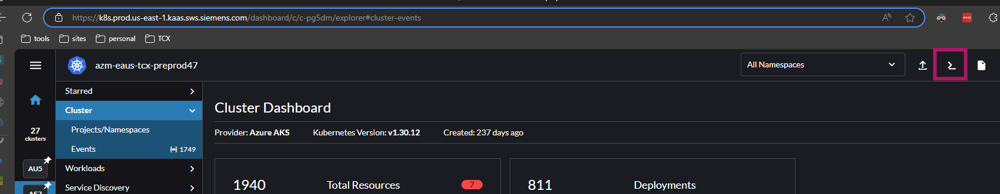
2. Type in the below code snippet to create the ServiceAccount:

```bash
kubectl apply -f - <<EOF
apiVersion: v1
kind: ServiceAccount
metadata:
  name: vault-token-reviewer
  namespace: vault-tcx
automountServiceAccountToken: false
EOF
```

  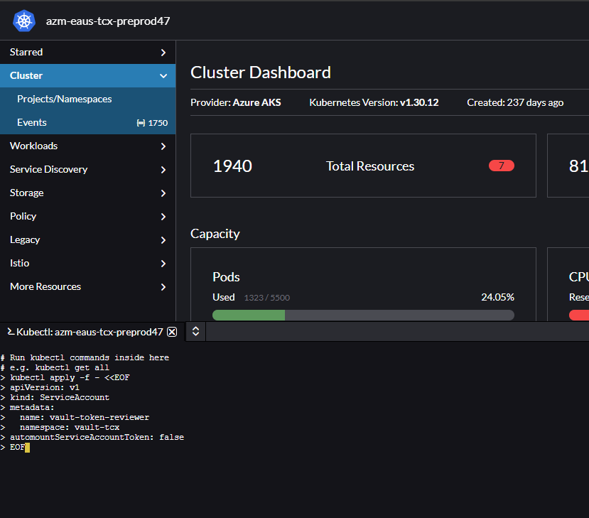
3. Verify the created resource in Rancher by navigating `More Resources` -> `Core` -> `ServiceAccounts`. Filter by namespace `vault-tcx` on top right.

  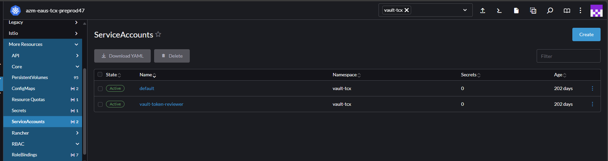
4. Respond back with confirmation on the ticket so that FDS can continue with `ClusterRoleBinding`.

---

### Update Vault with the ServiceAccount details

**Note**: Perform this steps only after FDS ticket for cluster provisioning is complete.

1. Open the Rancher link provided in the ticket, select the cluster mentioned in the FDS ticket and click on the shell icon on top right corner.

  
2. Type in the below code snippet to create the Secret:

```bash
kubectl apply -f - <<EOF
apiVersion: v1
kind: Secret
metadata:
  name: vault-k8s-auth-secret
  namespace: vault-tcx
  annotations:
    kubernetes.io/service-account.name: vault-token-reviewer
type: kubernetes.io/service-account-token
EOF
```

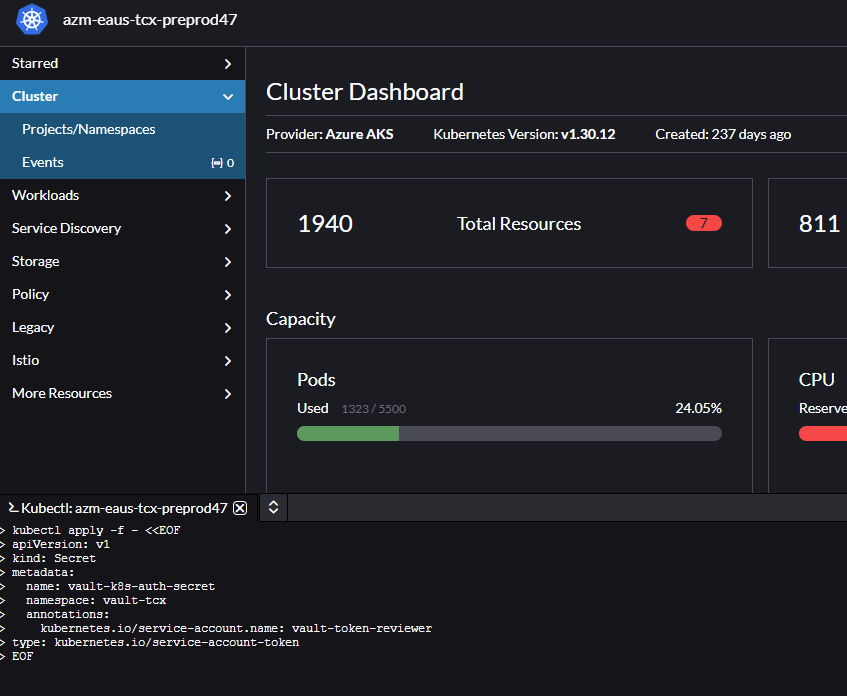
3. Verify the created resource in Rancher by navigating `Storage` -> `Secrets`. Filter by namespace `vault-tcx` on top right.

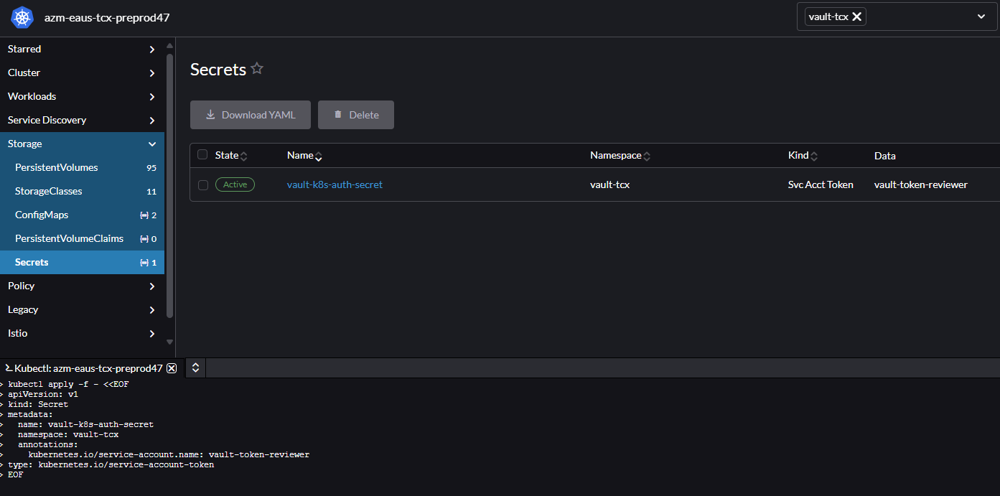
4. Get the below details from the FDS ticket raised above:
    - issuer
    - kubernetes_host
5. Get the below details from `vault-k8s-auth-secret` created above:
    - ca_certificate
    - token
  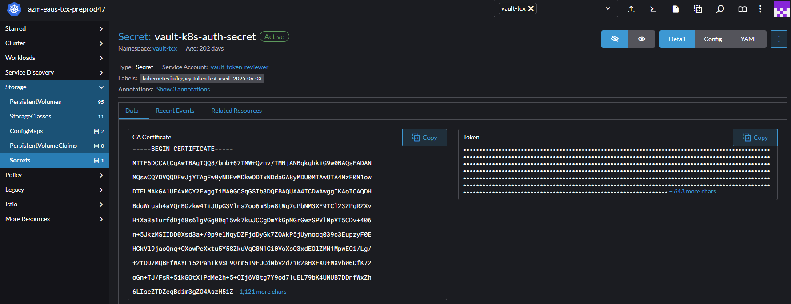
6. Login to the root namespace of Vault (use appropriate [prod](https://vault.xcr.gblsvcs01eu.prod.eu-central-1.kaas.sws.siemens.com) or [dev](https://vaultent.emea1.co.sws.siemens.com/) instance) and create a new Secret for the cluster. Path should be `secrets/secret/xcr/<ClusterName>` as shown below:  

  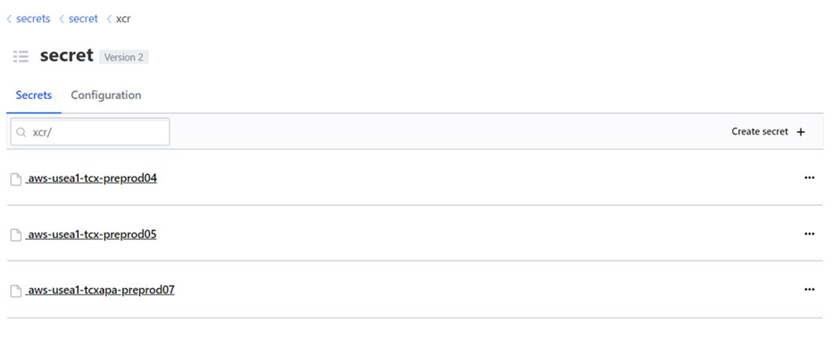
7. Update the below entries in the Vault with details from 4 and 5:

**Note**: Ensure that the Kubernetes host includes the https:// prefix.

  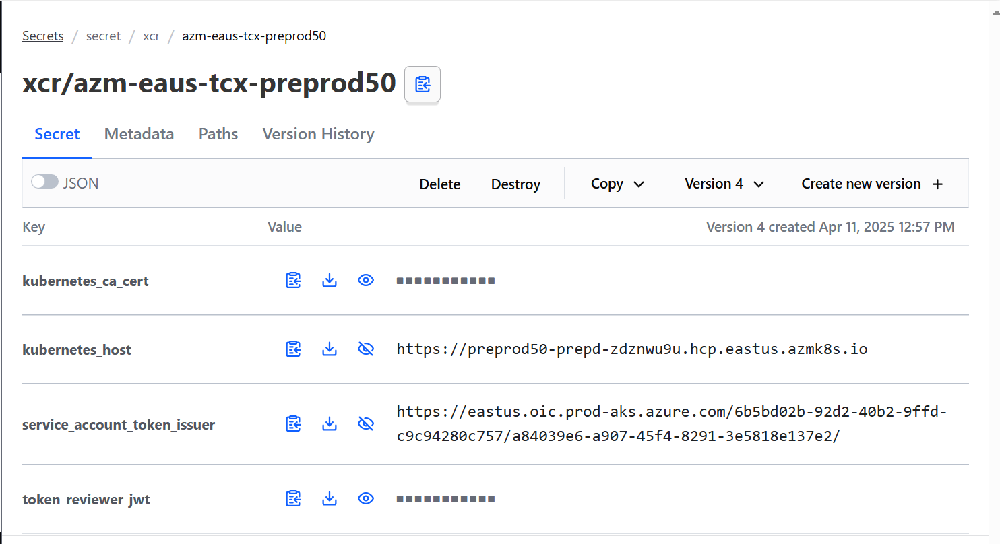

---

### Raise Snow ticket for Azure XCR to Admin License connectivity

**Note**: Raise this only when the cluster needs to be connected to the CAPS management plane.

Use below parameters for updating the ticket template below:

| CApS management plane | CIDR | AWS Account ID |
| ------ | ------ | ------ |
| Production | 10.149.18.0/23 | 361500002652 |
| Test | 10.149.26.0/23 | 014376623490 |

#### SNOW ticket for Firewall updates

1. Raise Firewall update request using [Snow Ticket](https://diswsiemens.service-now.com/sp?id=sc_cat_item_guide&sys_id=b9cf95651bfe885c0e21dc27bd4bcb53&table=sc_cat_item&searchTerm=disw:%20firewall%20rule%201%20-%20firewall%20rule%20request)

Refer below details for adding details to the ticket: 

| Argument | Value |
| ------ | ------ |
|  Requested for      |    &lt;&lt; Example :Jadhav, Neha &gt;&gt;    |
|  Requested by       |    &lt;&lt; Example : Jadhav, Neha &gt;&gt;    |
| How many rules would you like to request |   1      |
| Rule Type | Add permanent firewall rules |
| Business Justification |     The FDS cluster is hosted in Azure, and we have a License server in the CApS AWS account. We require reachability from the FDS Azure cluster pod to the AWS License server.  |  
| Source |  IP address(es)     |
| Source IP Address(es) |  Cluster Vnet CIDR provided by [XCR Team](./010_Request%20XCR%20Cluster.md#raise-fds-ticket-for-cluster) |
| Destination  |  IP address(es)     |
| Destination IP Address(es)| Select the Prod/Test CAPS management plane CIDR range as per requirement |
| Port or Port Range to Open | 28000, 28001 |
| Protocol  |IP , TCP , UDP |
| Default directionality is source TO destination. Bidirectional is only needed if the destination initiates traffic to the source as a new connection. Response traffic is always allowed without this selection.   |  False |

Example:

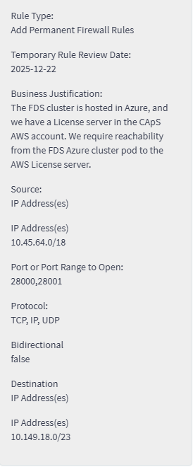

#### SNOW ticket for Network connectivity

Raise Network connectivity request using [Snow Ticket](https://diswsiemens.service-now.com/sp?id=sc_cat_item&table=sc_cat_item&sys_id=e0f8cc6fdb8542907571c3440596191b&recordUrl=com.glideapp.servicecatalog_cat_item_view.do%3Fv%3D1&sysparm_id=e0f8cc6fdb8542907571c3440596191b)

Note: The Cluster Region, Cluster Name, and Cluster VNet CIDR will be provided by the XCR team once the cluster provisioning is completed -> [Request XCR cluster](./010_Request%20XCR%20Cluster.md#raise-fds-ticket-for-cluster)

Refer below details for adding details to the ticket: 

| Argument | Value |
| ------ | ------ |
|  Requested for      |    &lt;&lt; Example :Jadhav, Neha &gt;&gt;    |
|  Requested by       |    &lt;&lt; Example : Jadhav, Neha &gt;&gt;    |
| Cloud Vendor |   Azure      |
| Azure Region Selection | &lt;&lt; Provide Cluster Region &gt;&gt;|  
| Do you have any on-prem dependencies? | No |
| Number of Routable DISW IP Addresses |  0 |
| Is access to Siemens AG (blue) users or services required  |  No   |
| Does your cloud application host CFIUS Data?| No   |
| Cloud Account ID | &lt; Cluster Name &gt; - &lt; Cluster Region &gt; |
| Description of Application/Service  | We are working across two clouds. The FDS cluster is hosted in Azure &lt; Cluster Region & zone &gt;, and we have a License server in the CApS AWS account &lt; AWS account ID &gt; (us-east-1). We require reachability from the FDS Azure cluster pod to the CApS AWS License server. CAPS management plane CIDR range - &lt; CAPS management plane CIDR range &gt; (us-east-1). FDS Cluster CIDR Range - &lt; Cluster Vnet CIDR &gt;. Please let me know if you required anything else. |
| Who is the contact that can answer any technical questions on network connectivity requirements?  | &lt;&lt; Provide your name &gt;&gt; |

Example:

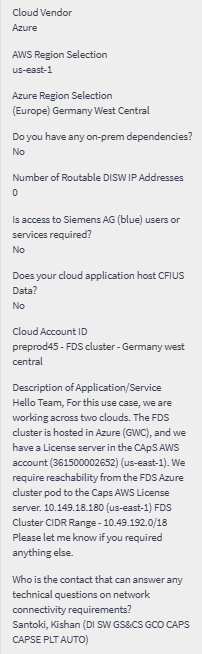

---

### Deploy required CRDs in the cluster

:::note Repository Access Required

Before proceeding, you need **Developer** access to the [`tcx-stormruntime`](https://gitlab.industrysoftware.automation.siemens.com/gitops/tcx-stormruntime) GitLab repository. If you receive a **404 / "Page not found"** error when opening the link, you do not yet have access.

**To request access**, reach out to one of the repository maintainers:

- Tushar Bhasme (tushar.bhasme@siemens.com)
- Donny Daniel (donny-thomas.daniel@siemens.com)
- Aishwarya Mehta (aishwarya.mehta@siemens.com)
- Yuvraj Chaudhary (yuvraj.chaudhari@siemens.com)

:::

1. Checkout a branch in https://gitlab.industrysoftware.automation.siemens.com/gitops/tcx-stormruntime/-/tree/main

    ```bash
    git clone git@gitlab.industrysoftware.automation.siemens.com:gitops/tcx-stormruntime.git 
    cd tcx-stormruntime/
    git checkout -b crds/[cluster-name]
    ```

2. Go to crds folder according to your region.

    | **No.** | **Region** | **Folder Name** | 
    |---------|--------|-----------------|
    | 1 | us-east-1, us-central | crds |
    | 2 | eu-central-1, germany-west-central | crds-emea |
    | 3 | ap-northeast-1 | crds-apac |

    ```bash
        cd <Your Folder Name>
    ```

3. Create a new folder for your cluster by copying existing folder (eg. azm-eaus-tcx-preprod53)

    ```bash
    mkdir [cluster_name]
    cp -r azm-eaus-tcx-preprod53/* ./[cluster-name]
    cd [cluster-name]
    ```

4. Update fqdnnp-operator/config.json to point to your cluster:

    ```json
    {
      "app": {
        "name": "<cluster-name>-fqdnnp-operator",
        "source": "https://gitlab.industrysoftware.automation.siemens.com/gitops/xcr-crds/tcx.git",
        "revision": "main",
        "path": "fqdnnp-operator",
        "clustername": "<cluster-name>",
        "namespace": "tcx-cluster-fqdnnp-operator"
      }
    }
    ```

5. Update tcx-cluster-resources/config.json to point to your cluster:

    ```json
    {
      "app": {
        "name": "<cluster-name>-cluster-resources",
        "source": "https://gitlab.industrysoftware.automation.siemens.com/gitops/xcr-crds/tcx.git",
        "revision": "main",
        "path": "tcx-cluster-resources",
        "clustername": "<cluster-name>",
        "namespace": "tcx-cluster-resources"
      }
    }
    ```
6. Add, commit and push your changes.

   ```bash
   git add .
   git commit -m "Add CRDs for [cluster-name]"
   git push origin crds/[cluster-name]
   ```

7. Create an MR and mark below for review:
    - Yuvraj Chaudhary
    - Tushar Bhasme
    - Aishwarya Mehta

</details>

---

<details>
<summary>**4. Reference**</summary>

- [FDS Cluster Onboarding Request](https://fdsone.atlassian.net/servicedesk/customer/portal/9/group/105/create/188)
- [FDSOne Help Center – General XCR Request](https://fdsone.atlassian.net/servicedesk/customer/portal/26/group/34/create/107)
- [Rancher](https://k8s.prod.us-east-1.kaas.sws.siemens.com/)
- [XCR Vault – Production](https://vault.xcr.gblsvcs01eu.prod.eu-central-1.kaas.sws.siemens.com)
- [XCR Vault – Dev/Non-prod](https://vaultent.emea1.co.sws.siemens.com/)
- [tcx-stormruntime GitLab Repository](https://gitlab.industrysoftware.automation.siemens.com/gitops/tcx-stormruntime)
- [SNOW Ticket – Firewall Rule Request](https://diswsiemens.service-now.com/sp?id=sc_cat_item_guide&sys_id=b9cf95651bfe885c0e21dc27bd4bcb53&table=sc_cat_item&searchTerm=disw:%20firewall%20rule%201%20-%20firewall%20rule%20request)
- [SNOW Ticket – Network Connectivity Request](https://diswsiemens.service-now.com/sp?id=sc_cat_item&table=sc_cat_item&sys_id=e0f8cc6fdb8542907571c3440596191b&recordUrl=com.glideapp.servicecatalog_cat_item_view.do%3Fv%3D1&sysparm_id=e0f8cc6fdb8542907571c3440596191b)
- [Activating Roles and Groups via PIM](../../../../Reference%20Resources/150_Appendix/030_Activating%20Roles%20and%20Groups%20via%20PIM.md)
- [Create Groups for Your Subscriptions](../../020_Tools%20Access/010_Cloud%20Account%20Request/Azure/020_Setup%20Azure%20and%20Entra%20Groups%20and%20Roles.md#create-groups-for-your-subscriptions)
- [Teamcenter AI Chat – AI Search (Azure)](../../../../../Product%20Integration%20Documentation/Teamcenter%20AI%20Chat/020_Cell%20Onboarding/010_AZURE/010_AI%20Search/010_AI%20Search.md)

</details>
