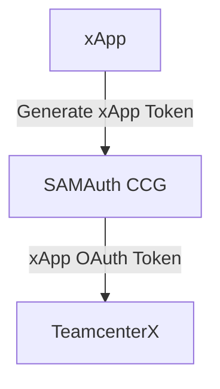
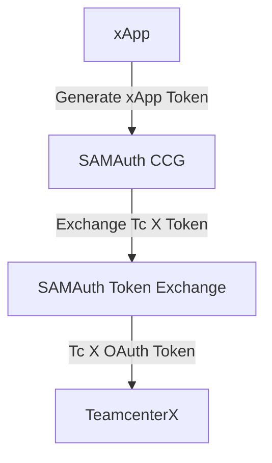

# Ingress: Requirements Before Running the Pipeline

To ensure a successful setup, please review and complete the following requirements before proceeding:

**Note: This section is not needed for NX X SKU and/or with product ID NXX35100. These product IDs have met these requirements.**

## Requirements for xApp to Generate an OAuth Token

To log in to Teamcenter X using an OAuth token, the xApp (External Application) must be able to generate and utilize its own token. The methods for generating the OAuth token differ based on whether you are using the Client Credential Grant or Token Exchange flow.

### 1. Client Credential Grant Approach

To generate the OAuth token using the Client Credential Grant:

- The xApp must be registered in SAMAuth as a SAMAuth Client Credential Grant-type application.
- Within this SAMAuth application, one or more SAMAuth `client_id` and `client_secret` pairs can be created.
- The xApp can then generate an OAuth token by using the SAMAuth `/token` endpoint, providing the client_id and client_secret as inputs.
- The SAMAuth app also has other attributes, such as scopes, which you can adjust to control the access embedded within the generated OAuth token.

From this activity, the following data is required for the pipeline:

If your xApp is registered in SAM 1.0:
- `client_id`

If your xApp is registered in SAM 2.0:
- `client_id`
- The `/token` endpoint used to generate your OAuth token

### 2. Token Exchange Approach

To generate the OAuth token using Token Exchange:

- Follow the same initial steps as the Client Credential Grant to generate an OAuth token (e.g., the xApp must be registered in SAMAuth as a SAMAuth Client Credential Grant-type application).
- For Token Exchange, an additional step is required to exchange the initial CCG (Client Credential Grant) token for a new token whose audience is set to the Teamcenter X client_id. This step requires another SAMAuth Token Exchange-type application. For more information about Token Exchange, please refer to the following [FDS Documentation](https://developer.internal.siemens.com/fds/documentation/APIservices/IAM/resources/tokenexchange.html)

From this activity, the following data is required for the pipeline:
- client_id (This is essentially the client_id of the Teamcenter X TcSS App).
- The `/token` endpoint or `iss` (Issuer ID) used to generate your OAuth token

**Note: Token Exchange is not supported in SAM 1.0**

> **Teamcenter X allows login using a `user token`. This is different from the Client Credential Grant or Token Exchange tokens. This mode of authentication allows an xApp's UserA to log in to Teamcenter X as UserA, meaning the username inside the token must be a valid Teamcenter (TC) user and must match exactly across both systems. To enable this, provide either the `/token` endpoint or the `iss` (Issuer ID) used to generate the user token. No `client_id` needs to be whitelisted in this case.**

## Teamcenter User

To support the OAuth token-based authentication system, in addition to the `client_id`, you will need a Teamcenter (TC) user who will **assume** the TC session once the login has been authenticated. This user must exist before any attempt to log in using an OAuth token is made.

We recommend the following options for creating this Teamcenter User:

- DC contribution code: Where make_user is called during installation or upgrade by the Deployment Center. Please refer to tcx2saas for more details.
- Manual step: To be performed as part of post-deployment steps using the `tcc exec` command, similiar to how CApS user is created.

From this activity, the following data is required for the pipeline:
- Teamcenter (TC) username
